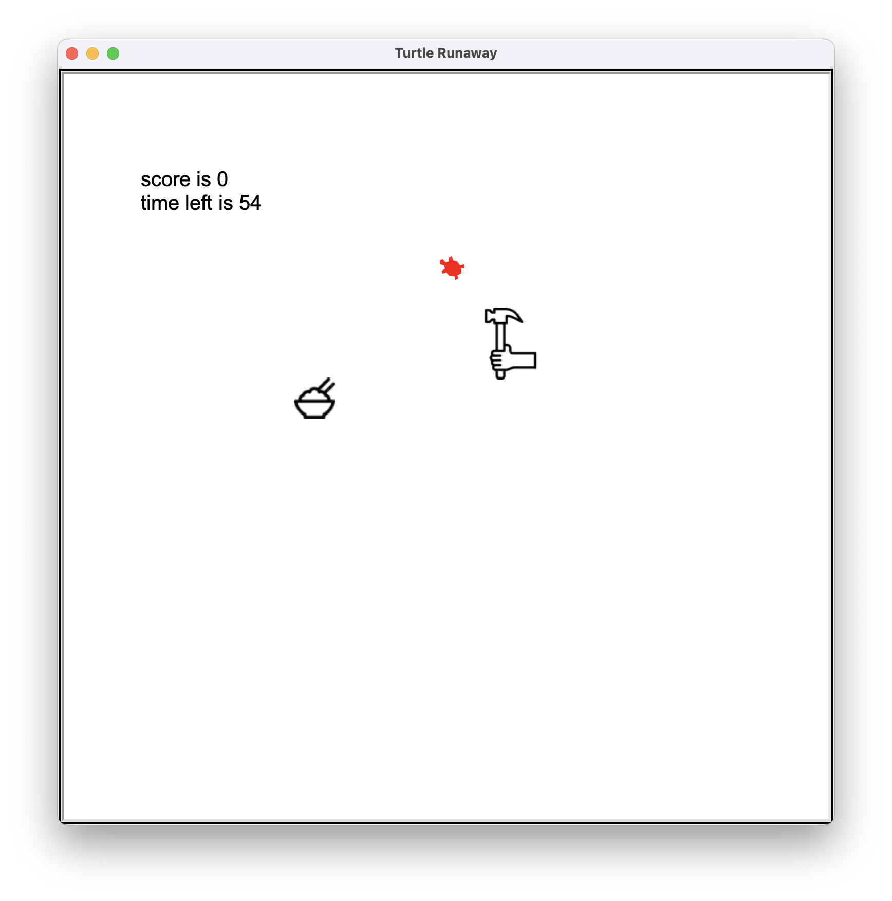
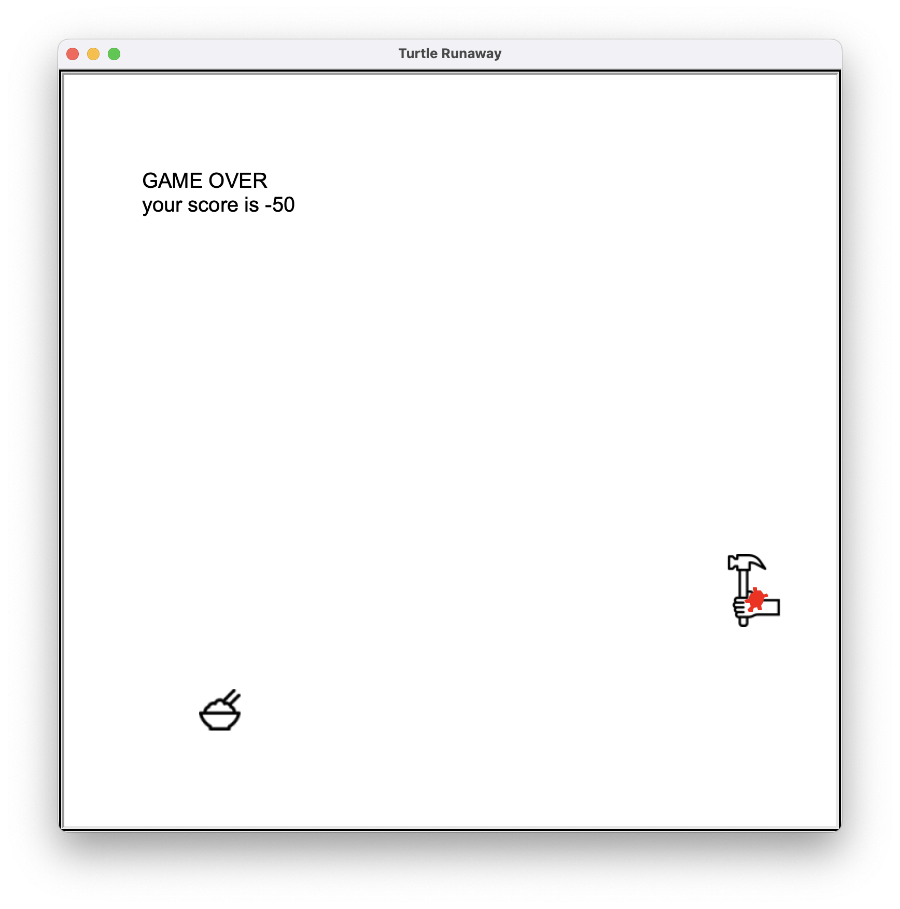

## turtle runaway 게임

* 주어진 시간 안에 망치를 피해서 밥을 먹는 게임입니다.
* 망치를 만나면 score가 10점 감소하며 밥을 먹으면 score가 10점 증가하게 됩니다.
* 망치는 기본적으로 사용자를 따라다니며 사용자가 있는 방향으로 매 스탭마다 20씩 쫓아가게 됩니다.
* 망치는 IntelligentMover로 구현되어 있습니다.
* 주어진 시간이 지나면 GameOver라는 문구가 뜨며 더이상 점수가 바뀌지 않습니다.
* 밥은 주어진 반경 안에서만 움직이게끔 되어있습니다. (-300, 300)

